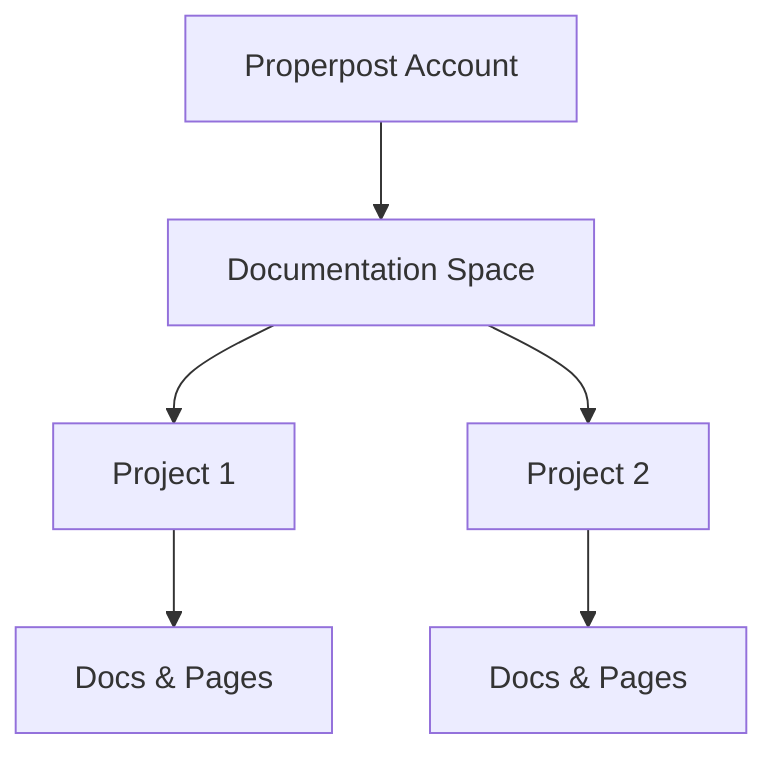

## Documentation Spaces

Properpost organizes your documentation into dedicated spaces. You create a space to group related projects and docs, making management intuitive. Each space acts as a container for multiple projects, enabling focused documentation workflows.

<Columns cols={3}>
  <Card title="Create Space" icon="plus" href="/docs/spaces/create">
    Set up a new space in seconds with custom permissions.
  </Card>
  <Card title="Manage Docs" icon="file-text" href="/docs/spaces/manage">
    Organize pages, folders, and assets within your space.
  </Card>
  <Card title="Switch Spaces" icon="switch" href="/docs/spaces/switch">
    Easily navigate between multiple spaces from the dashboard.
  </Card>
</Columns>



<Callout kind="tip">
  Start with one space per major product or team to keep organization clean.
</Callout>

## Project Organization Structure

Within a space, you structure projects hierarchically. Projects contain folders, pages, and components, allowing scalable documentation.

Use folders to categorize content like `api/`, `guides/`, and `changelogs/`.

<Tabs>
  <Tab title="Folder View" icon="folder">
    Organize hierarchically:
    
    ```
    project/
    ├── api/
    │   ├── endpoints.mdx
    │   └── schemas.mdx
    ├── guides/
    │   └── quickstart.mdx
    └── changelogs/
        └── v1.0.0.mdx
    ```
  </Tab>
  <Tab title="Page Tree View" icon="git-branch">
    Visualize your structure in the sidebar tree for quick navigation.
  </Tab>
</Tabs>

## Collaboration and Permissions

Properpost supports team collaboration with granular permissions. You assign roles at the space and project levels.

| Role       | View | Edit | Publish | Admin |
|------------|------|------|---------|-------|
| Viewer     | ✅   | ❌   | ❌      | ❌    |
| Editor     | ✅   | ✅   | ❌      | ❌    |
| Publisher  | ✅   | ✅   | ✅      | ❌    |
| Owner      | ✅   | ✅   | ✅      | ✅    |

<Steps>
  <Step title="Invite Collaborator" icon="users">
    Go to space settings and add users by email.
  </Step>
  <Step title="Assign Role" icon="shield">
    Select role from dropdown: Viewer, Editor, Publisher, or Owner.
  </Step>
  <Step title="Set Permissions" icon="settings">
    Customize access to specific projects or folders.
  </Step>
</Steps>

## Version Control Basics

Properpost integrates version control for docs. You track changes, revert updates, and maintain history without external tools.

<ExpandableGroup>
  <Expandable title="Commit Workflow" default-open="true">
    Make edits, preview changes, then commit with a message like `Fix API docs typo`.
  </Expandable>
  <Expandable title="Branching">
    Create branches for features: `git checkout -b feature/new-guide`.
  </Expandable>
</ExpandableGroup>

<CodeGroup tabs="CLI,API">
  ```bash
  properpost commit -m "Update core concepts"
  properpost push origin main
  ```
  ```javascript
  await properpost.commit({
    message: "Update core concepts",
    branch: "main"
  });
  ```
</CodeGroup>

Master these concepts to build efficient documentation workflows in Properpost.